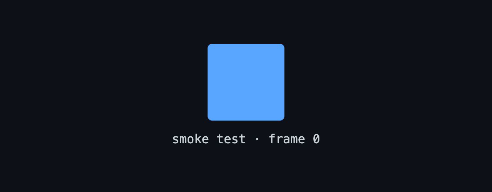

<!-- SMOKE TEST · TO BE REMOVED -->

  

<h1 align="center">
  
</h1>

  Full-Stack Developer from Taiwan 🇹🇼 
  Passionate about scalable web apps · Exploring DevOps &amp; Cloud

  
  
  
  

---

## 🛠️ Tech Stack

**Frontend**

**Backend & Runtime**

**DevOps & Infrastructure**

**Databases**

## 🌱 Currently Learning

- TypeScript advanced patterns & type-level programming
- DevOps best practices & CI/CD pipelines
- Harness platform

